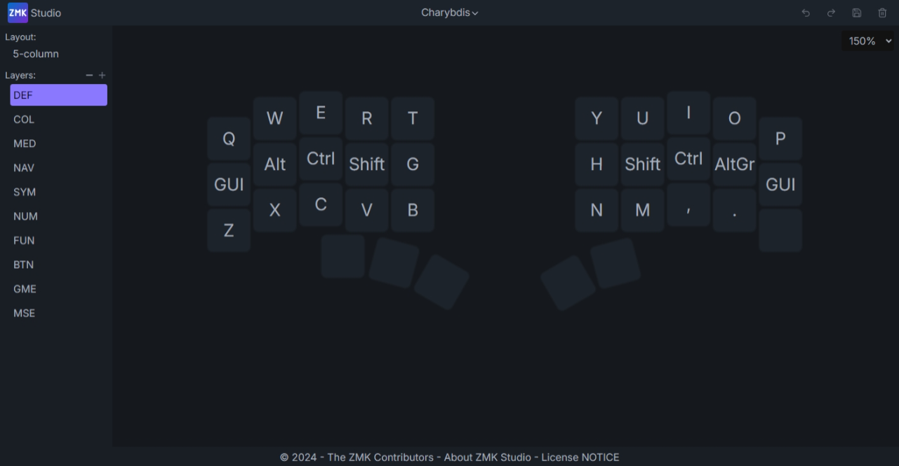

# Bastardkb Charybdis ZMK Module

## Setting up your Charybdis

- Open the following [link](https://github.com/zmkfirmware/unified-zmk-config-template), click the green `Use this template` button in the upper right corner, and create a new repository
- Navigate to your newly created repository
- Edit the `config/west.yml` file and add the Charybdis module as well as the pmw3610 driver:

```
manifest:
  remotes:
  - name: zmkfirmware
    url-base: https://github.com/zmkfirmware
  - name: badjeff
    url-base: https://github.com/badjeff
  projects:
  - name: zmk
    remote: zmkfirmware
    revision: main
    import: app/west.yml
  - name: zmk-pmw3610-driver
    remote: badjeff
    revision: main
  - name: zmk-keyboards-charybdis
    url: https://github.com/victorlucachi/zmk-keyboards-charybdis
    revision: main
    path: modules/zmk-keyboards-charybdis
  self:
    path: config
```

- Copy [the contents of the default keymap file](boards/shields/charybdis/charybdis.keymap), create a new `config/charybdis.keymap` file, paste and edit to customize the keymap
- Edit the `build.yml` file and add the Charybdis to the build list:

```
include:
  - board: nice_nano_v2
    shield: charybdis_dongle
    snippet: studio-rpc-usb-uart
    cmake-args: -DCONFIG_ZMK_STUDIO=y  
  - board: nice_nano_v2
    shield: charybdis_left
  - board: nice_nano_v2
    shield: charybdis_right
  - board: seeeduino_xiao_ble
    shield: settings_reset
  - board: nice_nano_v2
    shield: settings_reset
```

> [!NOTE]  
> If you're using a Seeeduino XIAO nrf52840 controller for the dongle, replace the board for your charybdis_dongle shield in the section above, from `nice_nano_v2` to `seeeduino_xiao_ble`

- After you're done customizing your keymap push the changes, and open the Github `Actions` tab of your config repository
- Open the latest workflow run, and after it's done building click on the `firmware` link under the Artifacts section of the page

> [!CAUTION]
> Double check the names of the .uf2 files prior to copying them to your controller. Flashing the wrong reset firmware (eg: nice_nano_v2 reset flashed on a xiao controller) might brick your controller, requiring additional hardware in order to fix it.

## Misc

#### ZMK Studio

The shield is ZMK Studio enabled; ZMK Studio is in early alpha, the web gui (works only with the central half connected via USB; for BLE Studio you have to use one of the ZMK Studio native apps available [here](https://github.com/zmkfirmware/zmk-studio/actions)) is available [here](https://main.alpha.zmk.studio/).



If you want to skip the unlocking step, create a `config/charybdis.conf` file, and add `CONFIG_ZMK_STUDIO_LOCKING=n` to it.

I only managed to test the 5 col Charybdis Nano with ZMK Studio, if you have a Charybdis Mini and you encounter any issues please let me know.